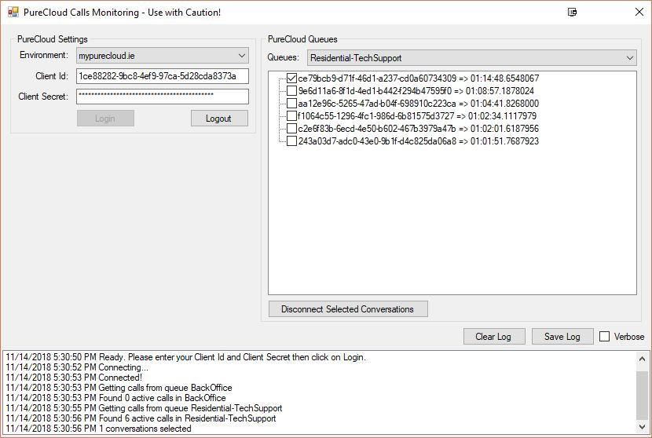

# PureCloud Disconnect Calls

This tool is used to disconnect PureCloud calls that might get stuck due to multiple reasons.
This tool should *ONLY* be used when absolutely required.

## Features

* Retrieve all active calls from a queue
* Button to disconnect selected calls

## Limitations

* Only works for calls (voice conversations)

## Installation

### Requirements

* Windows 7+
* [.Net Framework 4.5.2](https://www.microsoft.com/en-us/download/details.aspx?id=42642)
* Admin rights to your local machine
* Access to PureCloud (https://xxx.mypurecloud.xx)
* An OAuth Client Credentials client id & client secret

## User Guide

* Setup
  * Download the [setup](https://github.com/PierrickI3/PureCloudDisconnectCalls/releases/download/1.0/PureCloud.Disconnect.Calls.Tool.Setup.msi) file and follow the wizard
  * Double-click on the Desktop icon to get started
* Logging in
  * Open the app
  * Select your environment
  * Enter your Client Id & Client Secret
  * Click on the `Login` button and wait for the `Connected!` log message
* Finding Calls to disconnect
  * Select a queue
  * Active calls will show in the calls tree view
  * Select calls you want to disconnect
  * Click on `Disconnect Selected Conversations` to disconnect those calls
 